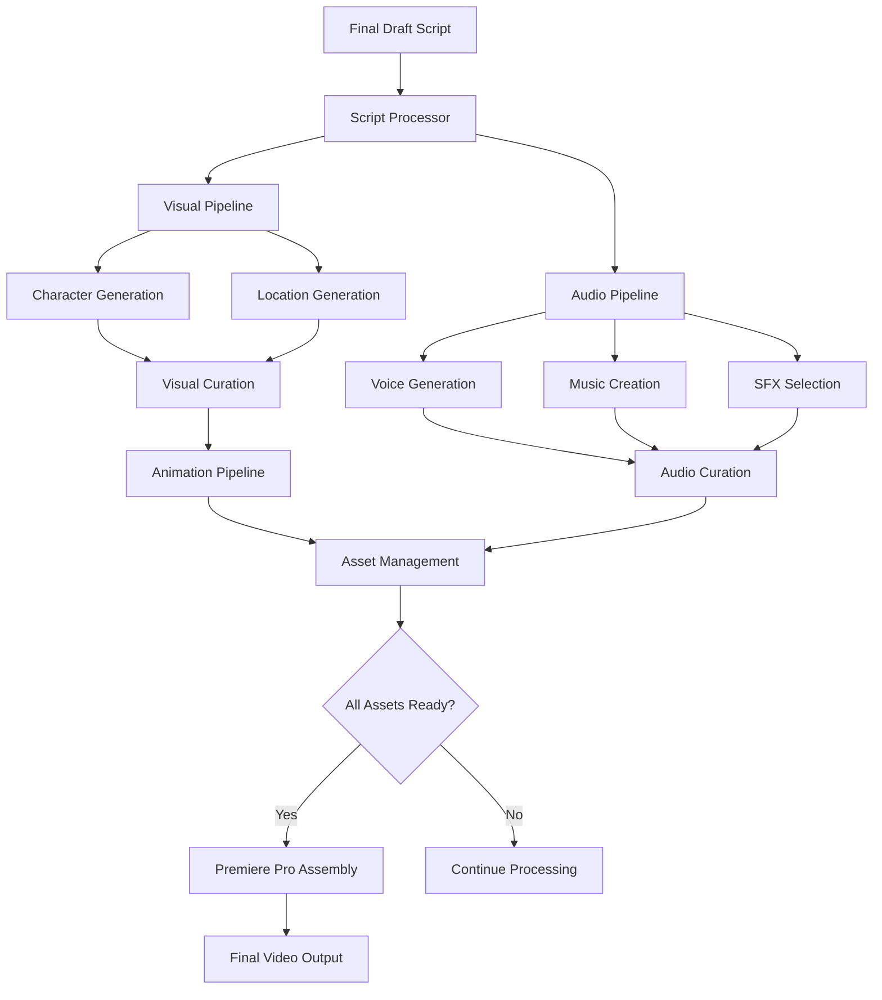

# AI Video Creation Automation - Architecture Documentation

## Overview

This documentation suite provides a comprehensive architecture for automating AI video creation workflows using n8n, based on a script-driven, parallel pipeline approach.

## Architecture Documents

### 1. [n8n Workflow Architecture](./n8n-workflow-architecture.md)
**Purpose**: Core workflow system design
**Key Components**:
- Script-driven processing workflow
- Parallel visual and audio pipelines  
- Database schema and file organization
- API integration strategy
- Error handling and monitoring

### 2. [Asset Management & Curation System](./asset-management-curation-system.md)
**Purpose**: Human approval workflow and asset organization
**Key Components**:
- File organization system with structured directories
- Web-based curation interface for approvals
- Real-time progress tracking across pipelines
- n8n integration points for workflow automation

### 3. [Premiere Pro Integration](./premiere-pro-integration.md) 
**Purpose**: Final assembly automation for video production
**Key Components**:
- ExtendScript automation for timeline assembly
- Scene-based video/audio synchronization
- Asset manifest system for organized imports
- Quality control and export management

## System Architecture Overview



## Key Architectural Principles

### 1. Script-Driven Approach
- **Single Source of Truth**: Final Draft screenplay drives all content generation
- **Structured Parsing**: Extract characters, locations, dialogue, and timing
- **Metadata Foundation**: Rich project metadata enables intelligent automation

### 2. Parallel Processing
- **Visual Pipeline**: Characters → Locations → Animation (concurrent processing)
- **Audio Pipeline**: Voices → Music → SFX (concurrent processing)  
- **Synchronized Progress**: Real-time coordination between pipelines

### 3. Human-in-the-Loop
- **Curation Points**: Strategic human approval for generated assets
- **Quality Control**: Web-based interfaces for asset selection
- **Feedback Loops**: Regeneration requests and iterative improvement

### 4. Asset Convergence
- **Organized Storage**: Project-based file organization with status tracking
- **Automated Assembly**: Premiere Pro integration for timeline creation
- **Quality Assurance**: Automated checks before final output

## Technology Stack

### Core Components
- **Workflow Engine**: n8n for orchestration and automation
- **Database**: PostgreSQL for project metadata and progress tracking
- **Backend**: Node.js/Express for API services and file management
- **Frontend**: React/TypeScript for curation interfaces
- **Video Assembly**: Adobe Premiere Pro with ExtendScript automation

### External APIs
- **Leonardo AI**: Character and location image generation
- **ElevenLabs**: Voice synthesis and cloning
- **Suno AI**: Music generation (third-party wrapper)
- **Soundstripe**: Sound effects library
- **Kling AI/Runway ML**: Image-to-video conversion

### Infrastructure
- **Containerization**: Docker for n8n and supporting services
- **File Storage**: Local filesystem with organized project structure
- **Monitoring**: Winston logging with progress tracking
- **CI/CD**: GitHub Actions with comprehensive quality gates

## Implementation Phases

### Phase 1: Foundation (Epic 1) ✅
- [x] TypeScript/Node.js project structure
- [x] Docker containerization and n8n setup
- [x] CI/CD pipeline with quality gates
- [x] Environment configuration and logging

### Phase 2: Script-Driven Foundation (Epic 2)
- [ ] Final Draft file parser (.fdx format)
- [ ] Script analysis system (characters, locations, dialogue)
- [ ] Project metadata database
- [ ] Content generation triggers

### Phase 3: Parallel Content Pipelines (Epic 3-4)
- [ ] API integrations (Leonardo AI, ElevenLabs, Suno, Soundstripe)
- [ ] Visual pipeline workflow (images → animation)
- [ ] Audio pipeline workflow (voices → music → SFX)
- [ ] Parallel processing orchestration

### Phase 4: Asset Management & Curation (Epic 5)
- [ ] Asset organization system
- [ ] Web-based curation interfaces
- [ ] Progress tracking dashboard
- [ ] Notification and approval workflows

### Phase 5: Final Assembly Integration (Epic 6)
- [ ] Premiere Pro ExtendScript automation
- [ ] Timeline generation from curated assets
- [ ] Quality control and export management
- [ ] Human review workflow

### Phase 6: MCP Server Development (Epic 7)
- [ ] Script processing MCP server
- [ ] Asset management MCP server  
- [ ] Premiere Pro automation MCP server
- [ ] Workflow orchestration MCP server

## File Organization

```
video-n8n/
├── src/                           # TypeScript source code
│   ├── api/                       # Express API routes
│   ├── workflows/                 # n8n workflow logic
│   ├── services/                  # External API integrations
│   └── utils/                     # Shared utilities
├── n8n-workflows/                 # n8n workflow definitions
├── mcp-servers/                   # MCP server implementations
├── scripts/                       # ExtendScript for Premiere Pro
├── docs/                          # Architecture documentation
├── tests/                         # Test suites
├── docker/                        # Docker configurations
└── projects/                      # Generated project assets
    └── {project-id}/
        ├── script/                # Original .fdx and parsed data
        ├── visual/                # Generated and curated images/videos
        ├── audio/                 # Generated and curated audio
        └── assembly/              # Premiere Pro projects and exports
```

## Development Workflow

### Git Strategy
- **Branch Naming**: `epic-N-description` for feature branches
- **Merge Strategy**: Rebase and merge to maintain clean linear history
- **CI/CD Gates**: 6 parallel quality checks must pass

### Quality Standards
- **Code Coverage**: 50% statements/functions/lines, 40% branches minimum
- **Code Quality**: ESLint/Prettier compliance, no console.log statements
- **Security**: CodeQL scanning, npm audit, no hardcoded secrets
- **Testing**: Jest unit tests, integration tests for Epic 2+

### Deployment Strategy
- **Epic-Based Development**: Each epic represents a major system component
- **Feature Flags**: Gradual rollout of new capabilities
- **Monitoring**: Comprehensive logging and error tracking

## Cost Considerations

### API Usage Optimization
- **Batch Processing**: Minimize API calls through intelligent batching
- **Caching Strategy**: Reduce redundant API requests
- **Budget Monitoring**: Track costs across all services
- **Fallback Mechanisms**: Handle API quota limitations gracefully

### Resource Management
- **Parallel Processing**: Optimize for concurrent workflow execution
- **Storage Efficiency**: Automated cleanup of intermediate files
- **Performance Monitoring**: Track resource usage and bottlenecks

## Next Steps

1. **Review Architecture**: Validate approach with stakeholders
2. **Begin Epic 2**: Start script processing foundation
3. **API Research**: Finalize third-party API integration strategies
4. **Prototype Development**: Build core components for validation
5. **Testing Strategy**: Develop comprehensive test plans for each epic

## Related Documents

- [CLAUDE.md](../CLAUDE.md) - Development guidelines and project overview
- [claude-plan.md](../claude-plan.md) - Original planning document
- [GitHub Issues](https://github.com/altsang/video-n8n/issues) - Detailed epic and user story tracking