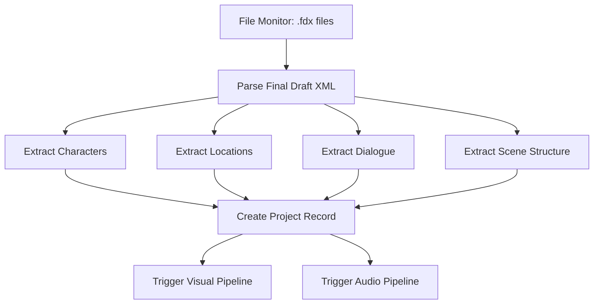
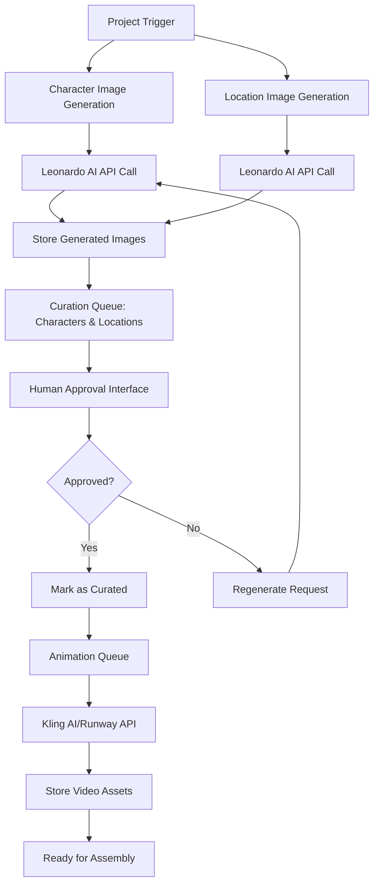
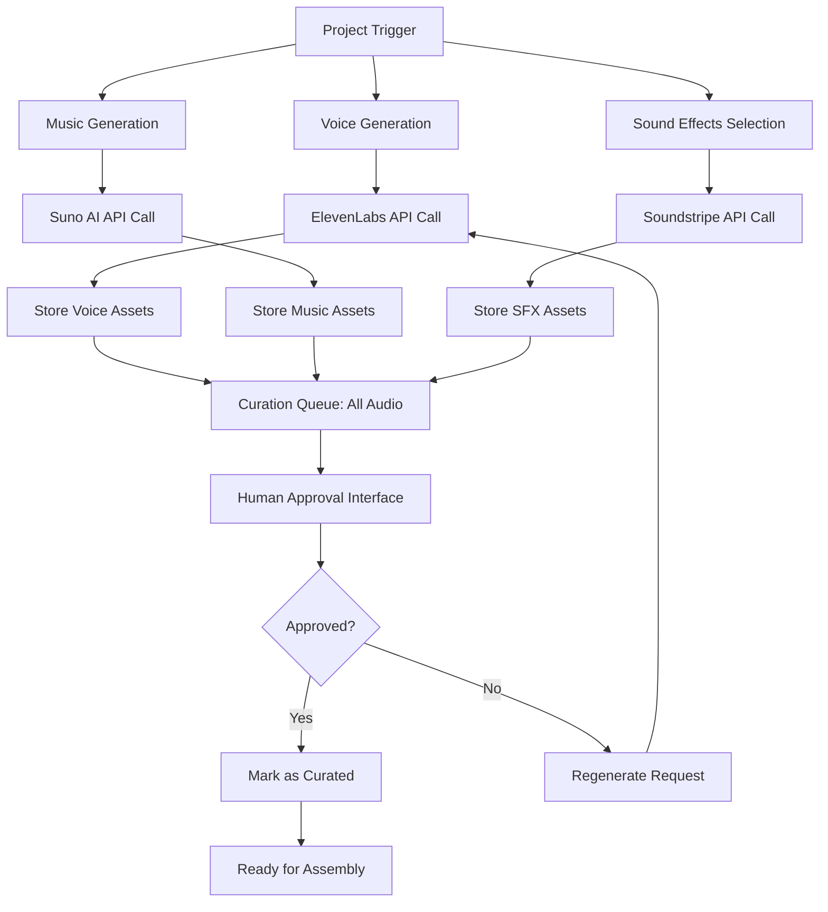
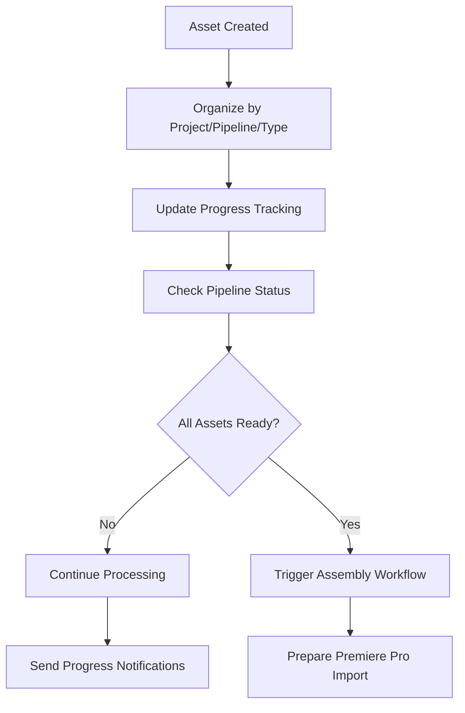
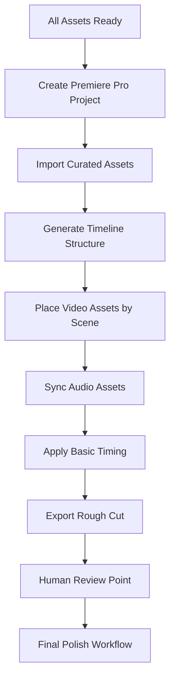

# n8n Parallel Workflow Architecture

## Overview

This document defines the n8n workflow architecture for the AI video creation automation system, based on the script-driven, parallel pipeline approach revealed in the workflow diagram.

## Core Architecture Principles

1. **Script-Driven**: All content generation is triggered and guided by Final Draft screenplay parsing
2. **Parallel Processing**: Visual and audio pipelines run concurrently 
3. **Human Curation**: Explicit approval points for generated assets
4. **Asset Convergence**: All pipelines converge in Premiere Pro for final assembly

## Workflow Structure

### 1. Script Processing Workflow (`script-processor`)

**Trigger**: File monitor watching for new .fdx files
**Purpose**: Parse screenplay and create project structure



**Key Outputs**:
- Project metadata in database
- Character list with descriptions
- Location list with descriptions
- Scene-by-scene dialogue breakdown
- Timing estimates

### 2. Visual Pipeline Workflow (`visual-pipeline`)

**Trigger**: New project created by script processor
**Purpose**: Generate and curate visual assets



**Key Components**:
- Leonardo AI integration for image generation
- Kling AI/Runway ML integration for animation
- Curation interface for approval workflow
- Asset organization system

### 3. Audio Pipeline Workflow (`audio-pipeline`)

**Trigger**: New project created by script processor
**Purpose**: Generate and curate audio assets



**Key Components**:
- ElevenLabs integration for voice synthesis
- Suno AI integration for music creation
- Soundstripe integration for sound effects
- Audio curation and approval system

### 4. Asset Management Workflow (`asset-manager`)

**Purpose**: Coordinate asset organization and track progress



**Key Functions**:
- File system organization
- Progress tracking across pipelines
- Notification management
- Assembly readiness detection

### 5. Final Assembly Workflow (`premiere-assembler`)

**Trigger**: All visual and audio assets curated and ready
**Purpose**: Automate Premiere Pro project creation and timeline assembly



**Key Components**:
- ExtendScript automation for Premiere Pro
- Timeline generation based on script timing
- Asset import and organization
- Rough cut assembly

## Database Schema

### Projects Table
```sql
CREATE TABLE projects (
    id UUID PRIMARY KEY,
    name VARCHAR(255),
    script_file_path VARCHAR(500),
    created_at TIMESTAMP,
    status VARCHAR(50), -- 'processing', 'visual_ready', 'audio_ready', 'ready_for_assembly', 'completed'
    visual_pipeline_progress INTEGER DEFAULT 0,
    audio_pipeline_progress INTEGER DEFAULT 0
);
```

### Characters Table
```sql
CREATE TABLE characters (
    id UUID PRIMARY KEY,
    project_id UUID REFERENCES projects(id),
    name VARCHAR(255),
    description TEXT,
    generated_images JSONB, -- Array of image paths/metadata
    curated_image_path VARCHAR(500),
    animation_path VARCHAR(500),
    status VARCHAR(50) -- 'pending', 'generated', 'curated', 'animated'
);
```

### Locations Table
```sql
CREATE TABLE locations (
    id UUID PRIMARY KEY,
    project_id UUID REFERENCES projects(id),
    name VARCHAR(255),
    description TEXT,
    generated_images JSONB,
    curated_image_path VARCHAR(500),
    animation_path VARCHAR(500),
    status VARCHAR(50)
);
```

### Audio Assets Table
```sql
CREATE TABLE audio_assets (
    id UUID PRIMARY KEY,
    project_id UUID REFERENCES projects(id),
    type VARCHAR(50), -- 'voice', 'music', 'sfx'
    description TEXT,
    generated_files JSONB,
    curated_file_path VARCHAR(500),
    status VARCHAR(50)
);
```

## File Organization Structure

```
projects/
├── {project-id}/
│   ├── script/
│   │   └── original.fdx
│   ├── visual/
│   │   ├── characters/
│   │   │   ├── generated/
│   │   │   ├── curated/
│   │   │   └── animated/
│   │   └── locations/
│   │       ├── generated/
│   │       ├── curated/
│   │       └── animated/
│   ├── audio/
│   │   ├── voices/
│   │   │   ├── generated/
│   │   │   └── curated/
│   │   ├── music/
│   │   │   ├── generated/
│   │   │   └── curated/
│   │   └── sfx/
│   │       ├── generated/
│   │       └── curated/
│   └── assembly/
│       ├── premiere-project/
│       ├── rough-cut/
│       └── final/
```

## API Integration Points

### External APIs Required
1. **Leonardo AI** - Character/location image generation
2. **ElevenLabs** - Voice synthesis
3. **Suno AI** - Music generation (third-party wrapper)
4. **Soundstripe** - Sound effects library
5. **Kling AI/Runway ML** - Image-to-video conversion

### Internal APIs
1. **Curation Web Interface** - Human approval workflows
2. **Progress Dashboard** - Real-time pipeline status
3. **Asset Management API** - File organization and metadata

## Error Handling & Monitoring

### Circuit Breakers
- API rate limiting and quota management
- Fallback mechanisms for third-party services
- Retry logic with exponential backoff

### Cost Monitoring
- Track API usage across all services
- Budget alerts and spending controls
- Cost per project analytics

### Progress Tracking
- Real-time pipeline status updates
- Notification system for curation queues
- Alert system for workflow failures

## Performance Considerations

### Parallel Processing
- Visual and audio pipelines run concurrently
- Database-level coordination to prevent conflicts
- Queue management for resource-intensive operations

### Scalability
- Horizontal scaling for API-heavy workflows
- File system optimization for large media assets
- Database indexing for quick asset lookups

### Caching Strategy
- Generated asset metadata caching
- API response caching where appropriate
- Frequently accessed script data caching