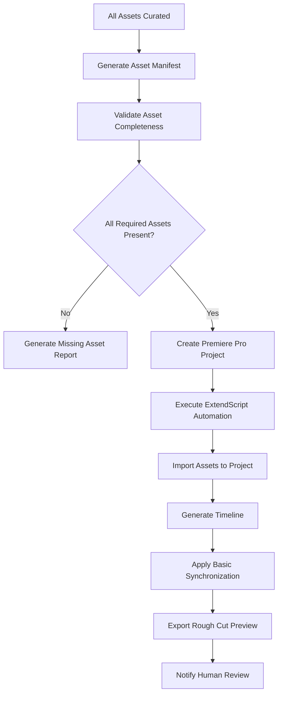

# Premiere Pro Integration for Final Assembly

## Overview

The Premiere Pro integration is the final convergence point where all curated visual and audio assets are automatically assembled into a timeline based on the script structure. This system bridges the gap between automated content generation and human creative control.

## Integration Strategy

### 1. ExtendScript vs UXP Decision

**Current Approach**: Start with ExtendScript for broader compatibility, plan migration to UXP

**ExtendScript Benefits**:
- Works with older Premiere Pro versions (CC 2018+)
- Extensive documentation and community support
- Mature automation capabilities

**UXP Migration Path**:
- Adobe's modern framework for Premiere Pro 2022+
- Better performance and security
- HTML/CSS/JavaScript based panels
- Future-proof development

### 2. Architecture Components

#### Core Integration Points
```
Final Assembly Workflow
├── Asset Import Automation
├── Timeline Generation Engine  
├── Scene-Based Assembly Logic
├── Audio Synchronization
└── Export Management
```

## Implementation Design

### 1. ExtendScript Automation Engine

#### Project Creation Script
```javascript
// premiere-automation.jsx
function createProjectFromAssets(projectData) {
    var project = app.project;
    
    // Create new project
    project.newProject(projectData.name + "_Assembly");
    
    // Create bins for organization
    var characterBin = project.rootItem.createBin("Characters");
    var locationBin = project.rootItem.createBin("Locations");
    var voiceBin = project.rootItem.createBin("Voices");
    var musicBin = project.rootItem.createBin("Music");
    var sfxBin = project.rootItem.createBin("Sound Effects");
    
    // Import and organize assets
    importAssetsByType(projectData.assets, {
        characters: characterBin,
        locations: locationBin,
        voices: voiceBin,
        music: musicBin,
        sfx: sfxBin
    });
    
    // Create timeline structure
    createTimelineFromScript(projectData.script);
    
    return project;
}
```

#### Asset Import System
```javascript
function importAssetsByType(assets, bins) {
    for (var assetType in assets) {
        var assetList = assets[assetType];
        var targetBin = bins[assetType];
        
        for (var i = 0; i < assetList.length; i++) {
            var asset = assetList[i];
            
            // Import file to Premiere Pro
            var importedItem = project.importFiles([asset.filePath])[0];
            
            // Move to appropriate bin
            importedItem.moveBin(targetBin);
            
            // Add metadata
            setAssetMetadata(importedItem, asset.metadata);
        }
    }
}

function setAssetMetadata(projectItem, metadata) {
    // Set custom metadata for asset tracking
    projectItem.setPropertyValue("client.name", metadata.originalName || "");
    projectItem.setPropertyValue("client.description", metadata.description || "");
    projectItem.setPropertyValue("client.assetType", metadata.type || "");
    projectItem.setPropertyValue("client.sceneReferences", JSON.stringify(metadata.scenes || []));
}
```

#### Timeline Assembly Engine
```javascript
function createTimelineFromScript(scriptData) {
    var sequence = project.activeSequence;
    if (!sequence) {
        // Create new sequence with standard settings
        sequence = project.createNewSequence("Main_Timeline", "custom");
    }
    
    var currentTime = 0; // Starting timecode
    
    for (var i = 0; i < scriptData.scenes.length; i++) {
        var scene = scriptData.scenes[i];
        
        // Add location/environment video
        if (scene.location && scene.location.animatedAsset) {
            addVideoToTimeline(sequence, scene.location.animatedAsset, currentTime, scene.duration);
        }
        
        // Add character videos with timing
        for (var j = 0; j < scene.characters.length; j++) {
            var character = scene.characters[j];
            if (character.animatedAsset && character.screenTime) {
                addVideoToTimeline(sequence, character.animatedAsset, 
                    currentTime + character.screenTime.start, 
                    character.screenTime.duration);
            }
        }
        
        // Add dialogue audio
        if (scene.dialogue) {
            addAudioToTimeline(sequence, scene.dialogue.audioAsset, currentTime, scene.duration);
        }
        
        // Add background music
        if (scene.music) {
            addMusicToTimeline(sequence, scene.music.audioAsset, currentTime, scene.duration);
        }
        
        currentTime += scene.duration;
    }
    
    // Auto-sync and adjust overlaps
    synchronizeAudioVideo(sequence);
}
```

#### Audio/Video Synchronization
```javascript
function synchronizeAudioVideo(sequence) {
    var videoTracks = sequence.videoTracks;
    var audioTracks = sequence.audioTracks;
    
    // Smart gap detection and filling
    for (var i = 0; i < videoTracks.numTracks; i++) {
        var track = videoTracks[i];
        detectAndFillGaps(track);
    }
    
    // Audio level normalization
    for (var i = 0; i < audioTracks.numTracks; i++) {
        var track = audioTracks[i];
        normalizeAudioLevels(track);
    }
    
    // Cross-fade between clips
    addAutomaticTransitions(sequence);
}

function detectAndFillGaps(videoTrack) {
    var clips = videoTrack.clips;
    
    for (var i = 0; i < clips.numItems - 1; i++) {
        var currentClip = clips[i];
        var nextClip = clips[i + 1];
        
        var gapDuration = nextClip.start.seconds - currentClip.end.seconds;
        
        if (gapDuration > 0.1) { // 100ms gap threshold
            // Extend current clip or add transition
            extendClipOrAddTransition(currentClip, nextClip, gapDuration);
        }
    }
}
```

### 2. Timeline Generation Logic

#### Scene-Based Assembly
```javascript
class SceneAssembler {
    constructor(scriptData, assetManifest) {
        this.script = scriptData;
        this.assets = assetManifest;
    }
    
    generateTimeline() {
        var timeline = {
            videoTracks: [],
            audioTracks: [],
            totalDuration: 0
        };
        
        for (var scene of this.script.scenes) {
            var sceneTimeline = this.assembleScene(scene);
            this.mergeSceneIntoTimeline(timeline, sceneTimeline);
        }
        
        return timeline;
    }
    
    assembleScene(scene) {
        return {
            videoElements: this.getVideoElementsForScene(scene),
            audioElements: this.getAudioElementsForScene(scene),
            startTime: scene.timingInfo.start,
            duration: scene.timingInfo.duration
        };
    }
    
    getVideoElementsForScene(scene) {
        var elements = [];
        
        // Background/location video
        if (scene.location) {
            elements.push({
                type: 'location',
                asset: this.assets.locations[scene.location.name],
                layer: 1,
                startTime: 0,
                duration: scene.timingInfo.duration
            });
        }
        
        // Character videos with dialogue timing
        for (var dialogue of scene.dialogues) {
            if (dialogue.character && this.assets.characters[dialogue.character]) {
                elements.push({
                    type: 'character',
                    asset: this.assets.characters[dialogue.character],
                    layer: 2,
                    startTime: dialogue.timing.start,
                    duration: dialogue.timing.duration,
                    characterName: dialogue.character
                });
            }
        }
        
        return elements;
    }
    
    getAudioElementsForScene(scene) {
        var elements = [];
        
        // Dialogue audio
        for (var dialogue of scene.dialogues) {
            elements.push({
                type: 'dialogue',
                asset: this.assets.voices[dialogue.character],
                track: 1,
                startTime: dialogue.timing.start,
                duration: dialogue.timing.duration,
                text: dialogue.text
            });
        }
        
        // Background music
        if (scene.music) {
            elements.push({
                type: 'music',
                asset: this.assets.music[scene.music.trackId],
                track: 2,
                startTime: 0,
                duration: scene.timingInfo.duration,
                volume: 0.3 // Background level
            });
        }
        
        // Sound effects
        for (var sfx of scene.soundEffects || []) {
            elements.push({
                type: 'sfx',
                asset: this.assets.sfx[sfx.effectId],
                track: 3,
                startTime: sfx.timing.start,
                duration: sfx.timing.duration
            });
        }
        
        return elements;
    }
}
```

### 3. Asset Manifest System

#### Asset Organization Schema
```json
{
  "projectId": "uuid",
  "assetManifest": {
    "characters": {
      "character_name": {
        "imageAsset": "/path/to/curated/image.png",
        "animatedAsset": "/path/to/animated/video.mp4",
        "voiceAsset": "/path/to/voice/audio.wav",
        "metadata": {
          "description": "Character description",
          "style": "animation_style",
          "duration": 45.5
        }
      }
    },
    "locations": {
      "location_name": {
        "imageAsset": "/path/to/location/image.png",
        "animatedAsset": "/path/to/location/video.mp4",
        "metadata": {
          "type": "indoor|outdoor",
          "timeOfDay": "morning|afternoon|evening|night",
          "mood": "cheerful|dramatic|mysterious"
        }
      }
    },
    "audio": {
      "music": [
        {
          "trackId": "track_001",
          "filePath": "/path/to/music.wav",
          "genre": "cinematic",
          "mood": "uplifting",
          "duration": 120.0,
          "bpm": 120
        }
      ],
      "sfx": [
        {
          "effectId": "sfx_001", 
          "filePath": "/path/to/effect.wav",
          "type": "ambient|action|transition",
          "duration": 3.5
        }
      ]
    }
  }
}
```

### 4. n8n Integration Workflow

#### Assembly Trigger Workflow


#### Custom n8n Node for Premiere Integration
```typescript
class PremiereProAssemblyNode implements INodeType {
    description: INodeTypeDescription = {
        displayName: 'Premiere Pro Assembly',
        name: 'premiereProAssembly',
        group: ['transform'],
        version: 1,
        description: 'Automate Premiere Pro project creation and timeline assembly',
        defaults: {
            name: 'Premiere Assembly',
        },
        inputs: ['main'],
        outputs: ['main'],
        properties: [
            {
                displayName: 'Project Data',
                name: 'projectData',
                type: 'json',
                default: '',
                description: 'JSON containing script and asset manifest data',
            },
            {
                displayName: 'Template',
                name: 'template',
                type: 'options',
                options: [
                    { name: 'Standard Timeline', value: 'standard' },
                    { name: 'Multi-Camera', value: 'multicam' },
                    { name: 'Dialogue Heavy', value: 'dialogue' },
                ],
                default: 'standard',
            },
        ],
    };

    async execute(this: IExecuteFunctions): Promise<INodeExecutionData[][]> {
        const items = this.getInputData();
        const returnData: INodeExecutionData[] = [];

        for (let i = 0; i < items.length; i++) {
            const projectData = this.getNodeParameter('projectData', i) as object;
            const template = this.getNodeParameter('template', i) as string;

            // Execute Premiere Pro automation
            const result = await this.executePremiereAutomation(projectData, template);

            returnData.push({
                json: {
                    projectPath: result.projectPath,
                    timelineDuration: result.duration,
                    assetsImported: result.assetCount,
                    status: 'completed'
                }
            });
        }

        return [returnData];
    }

    private async executePremiereAutomation(projectData: any, template: string) {
        // Execute ExtendScript via command line or CEP extension
        const scriptPath = path.join(__dirname, 'scripts', 'premiere-automation.jsx');
        const command = `"${PREMIERE_PATH}" -project "${scriptPath}" -args "${JSON.stringify(projectData)}"`;
        
        const result = await exec(command);
        return JSON.parse(result.stdout);
    }
}
```

### 5. Quality Control & Export Management

#### Automated Quality Checks
```javascript
function performQualityChecks(sequence) {
    var issues = [];
    
    // Check for gaps in timeline
    var gaps = detectTimelineGaps(sequence);
    if (gaps.length > 0) {
        issues.push({
            type: 'gaps',
            description: 'Timeline has unexpected gaps',
            locations: gaps
        });
    }
    
    // Check audio levels
    var audioIssues = checkAudioLevels(sequence);
    if (audioIssues.length > 0) {
        issues.push({
            type: 'audio',
            description: 'Audio level issues detected',
            details: audioIssues
        });
    }
    
    // Check video resolution consistency
    var resolutionIssues = checkVideoResolution(sequence);
    if (resolutionIssues.length > 0) {
        issues.push({
            type: 'resolution',
            description: 'Video resolution inconsistencies',
            details: resolutionIssues
        });
    }
    
    return issues;
}
```

#### Export Presets
```javascript
var EXPORT_PRESETS = {
    roughCut: {
        format: 'H.264',
        preset: 'YouTube 1080p HD',
        quality: 'Medium',
        description: 'Fast preview for human review'
    },
    finalDelivery: {
        format: 'H.264',
        preset: 'Custom High Quality',
        quality: 'Maximum',
        description: 'High quality final output'
    },
    webPreview: {
        format: 'H.264',
        preset: 'Web Video Small',
        quality: 'Medium',
        description: 'Small file for web sharing'
    }
};

function exportWithPreset(sequence, presetName, outputPath) {
    var preset = EXPORT_PRESETS[presetName];
    
    // Configure export settings
    var exporter = sequence.exportAsMediaDirect(
        outputPath,
        preset.preset,
        app.encoder.ENCODE_IN_TO_OUT
    );
    
    return exporter;
}
```

### 6. Human Review Integration

#### Review Workflow
1. **Automated Assembly Complete**: ExtendScript generates timeline
2. **Quality Check Report**: Automated validation results
3. **Rough Cut Export**: Quick preview for human review
4. **Review Interface**: Web-based player with annotation tools
5. **Revision Requests**: Feedback loop for adjustments
6. **Final Approval**: Trigger final export workflow

#### Review Dashboard Features
- Timeline visualization with scene markers
- Side-by-side comparison (script vs. assembled timeline)
- Audio waveform analysis
- Frame-by-frame review capabilities
- Annotation and feedback tools
- Approval/revision workflow

## Implementation Timeline

### Phase 1: ExtendScript Foundation (2-3 weeks)
- Basic project creation and asset import
- Timeline generation from script data
- Simple audio/video synchronization

### Phase 2: Advanced Assembly (2-3 weeks) 
- Scene-based timeline logic
- Asset manifest integration
- Quality control automation

### Phase 3: n8n Integration (1-2 weeks)
- Custom n8n nodes
- Workflow automation
- Error handling and monitoring

### Phase 4: Review System (2-3 weeks)
- Web-based review interface
- Annotation and feedback tools
- Revision workflow automation

### Phase 5: UXP Migration Planning (1-2 weeks)
- UXP architecture planning
- Migration strategy development
- Future-proofing considerations

## Performance Considerations

### Optimization Strategies
- Template-based project creation for speed
- Batch import operations
- Background rendering where possible
- Progressive timeline building
- Asset preloading and caching

### Error Handling
- Graceful degradation for missing assets
- Automatic retry mechanisms
- Human intervention points for complex issues
- Detailed logging for troubleshooting

### Scalability
- Support for multiple Premiere Pro instances
- Queue management for large projects
- Resource monitoring and allocation
- Cloud rendering integration potential